# 软件工程实训实验报告

## 1.阅读和描述样例工程 / 标注样例工程中的代码

    在网上申请了班级任务后，把代码fork到了仓库sept1-sjsaasdasd-1，详细阅读了代码之后在javadoc 中添加了注释，并建立了以下类图：

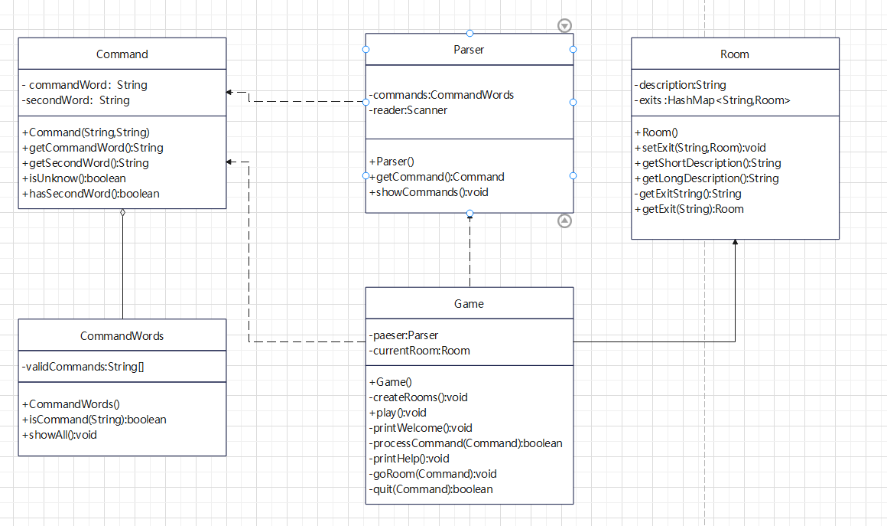

####  

    之后尝试将新的代码加入仓库首先要将它提交到本地仓库，然后从网站上create new pull request前几次因为注释的位置导致代码格式化审核出现问题，最后一次才成功

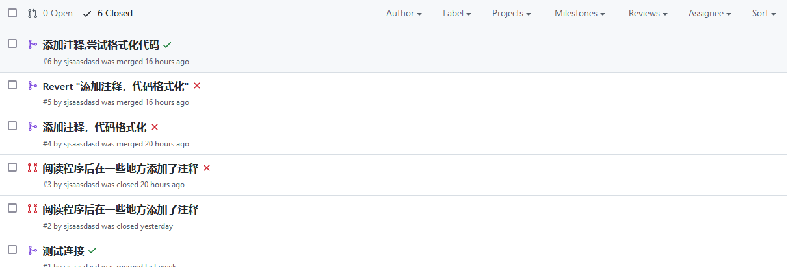

####  

    到此为止对GitHub的使用和代码的基本框架有了较为详细地了解

## 2.扩充和维护样例工程
>问题说明：
>在Game类的processCommand()
>方法中，当用户输入的命令被辨认出来以后，有一系列的if语句用来分派程序到不同的地方去执行。
>从面向对象的设计原则来看，这种解决方案不太好，因为每当要加入一个新的命令时，就得在这一
>堆if语句中再加入一个if分支，最终会导致这个方法的代码膨胀得极其臃肿。如何改进程序中的这
>个设计，使得命令的处理更模块化，且新命令的加入能更轻松？请描述你的解决思路，并对你的解决方案进行实现和测试。
###
    经过查找资料之后发现可以采用“策略模式”来减少代码中的if——else语句，实现算法的上下文分离。策略模式需要定义一个上下文对象Context、抽象的策略角色Strategy，并在
    功能的实现中将策略角色Strategy具象化，通过继承来实现不同操作。
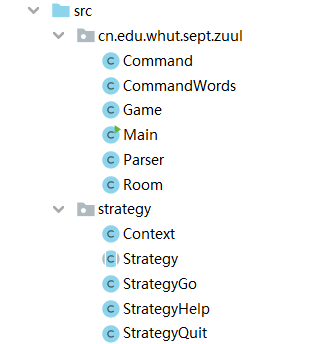
###
    这里我们通过继承将动作“go”，“help”，“quit”进行分离，具体操作通过重写Strategy类的copeWithCommand()方法实现最终我们得到的。下边展示一下样例类的构成：
Context类
###
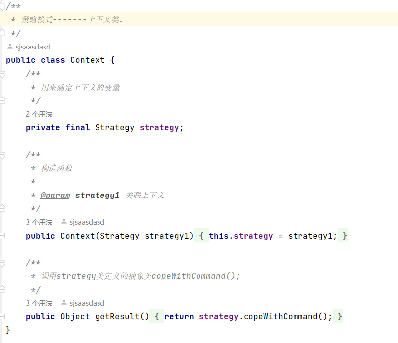
###
Strategy类
###
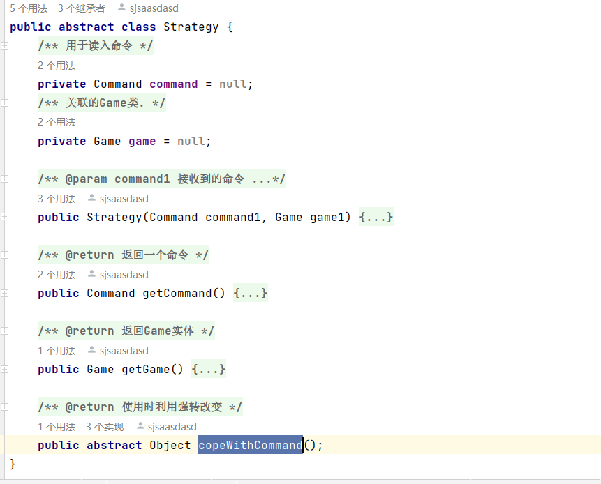
###
    最终在每个Strategy的子类中copeWithCommand()方法的实现结果和原本在Game类中的实现方法差别不大，但返回值设置为Object令方法显得更为灵活。优化后的processCommand()如下：
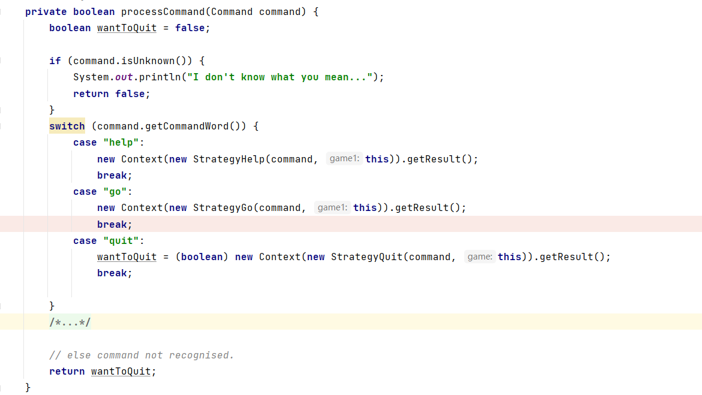
###
    优化后我们只需要根据新的操作定义新的策略，然后传入Command，Game对象即可。
## 3. 功能扩充点
>扩充点①：将Room类修改为抽象的Absroom类，利用工厂模式来创建Room，并在房间中添加物品
###
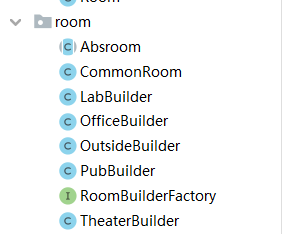
###
    这次修改的重点在于Absroom，RoomBuilderFactory两个类。其中Absroom本质上是将Room类抽象并在其中添加保存房间内物品的Map型变量
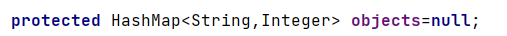
###
    RoomBuilderFactory实际上是一个接口，包含了生成一个房间的抽象方法createRoom()
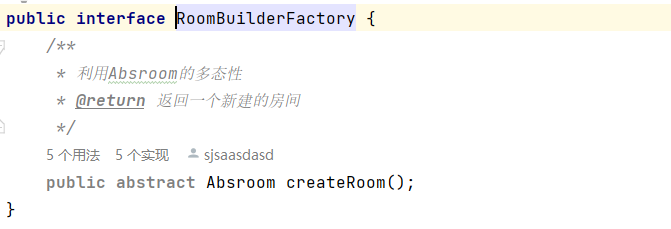
###
    在这个接口的方法实现时，实际上是将初始化的内容在createRoom方法中补全，利用CommonRoom的构造方法返回一个“房间”例如：
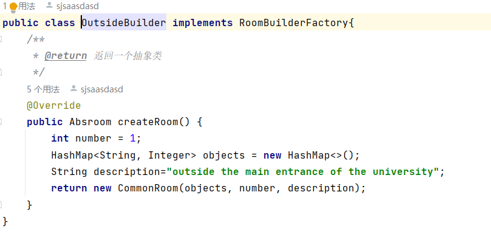
>修改点②：增加look和back功能
###
    利用策略模式将look和back的策略实现，然后在CommandWords类和Game类中添加相应的字符串和方法调用即可。
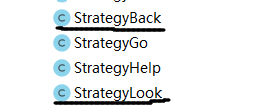
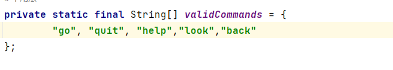
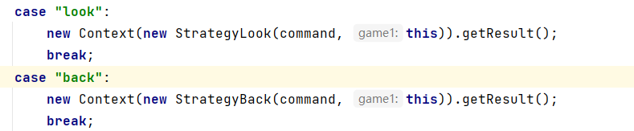